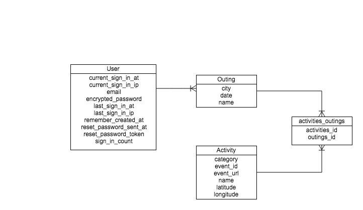

#Mappetizer

###GA WDI DC August 2014, Project 2

###Overview

**Mappetize** is a social web application that enables friends to more effectively plan group outings. Four students in the August 2014 cohort of General Assembly's Web Development Immersive in Washington, D.C. developed the app: Pam Assogba, Wade Buckland, Martin Johnson, and Lisa Snider. The team built the app from the ground up during a 4-day sprint modeling the agile software development process. 

[Visit Mappetize] (http://fathomless-ravine-7965.herokuapp.com/)

###User stories completed:
- As a guest, I can visit a homepage that links to sign-in and sign-up pages.
- As a user, I can sign-in to my account.
- As a guest, I can sign-up for an account.
- As a user, I can view, edit, and delete outings that I've created in the past.
- As a user, I can create a new outing by selecting a location and a date range.
- As a user, I can add events to my outing by selecting markers on a map.
- As a user, I can share my outing with others via email.

Mappetize uses two APIs:
Mapbox: https://www.mapbox.com/developers/api/
Eventbrite: http://developer.eventbrite.com/

Based on date and location selections by the user, event data are pulled from the Eventbrite API and subsequently passed to the Mapbox API.

###Backlog: 
For list of user stories and backlog, see our public Pivitol Tracker: https://www.pivotaltracker.com/s/projects/1181394.

###Technology used:
- Ruby on Rails 4.1.6.
- PostgreSQL Database
- The Devise gem for authentication and authorization.
- The front-end Foundation framework for styling and laying out the site.
- The mail gem, which allows users to send emails from the app.
- The letter opener gem that allowed us to preview email in the browser instead of sending it and not set-up email in development.

###ERD:

### Local Setup

    rake db:create
    bundle install
    rake db:migrate
    rake db:seed
    rails s

    Open the page locally on http://localhost:3000.
    Note that you will need to request access tokens for both the Eventbrite and Mapbox apis and replace them as appropriate within the code. 
    
=
######Written by Team Appetize
